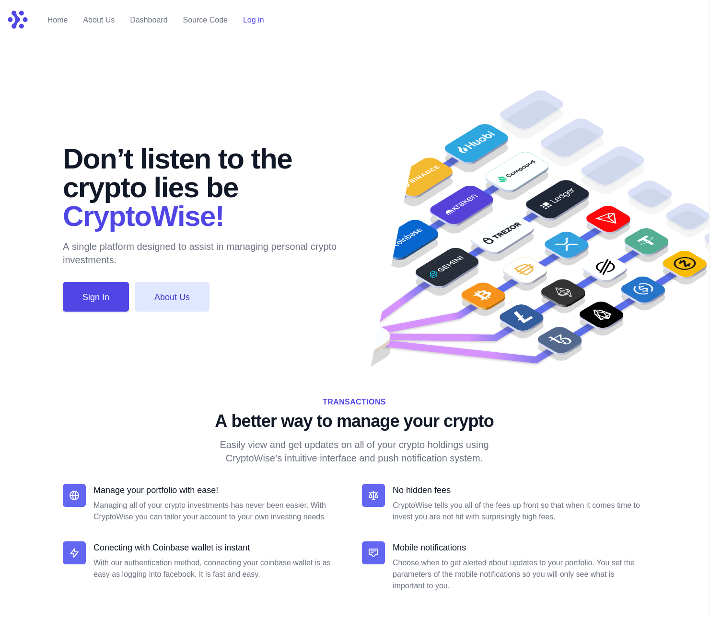

# CryptoWise (Bitcamp - 04/11/2021)

**Description**: CryptoWise is a platform designed to assist in managing personal crypto investments.

**Built by**: Shiv Patel, Samual Johnson, and Bobby Coz

## Demos

[Devpost Link](https://devpost.com/software/cryptowise) | [Product Demo (link)](https://crypto-wise-bitcamp-2021.vercel.app/)

## Inspiration

With the rise in popularity around crypto currencies such as Bitcoin, our team wanted to find a way to ease the stress behind investing in a new currency. You don't want to check your portfolio after a few months and see your Bitcoin investment dropped over 60% like it did 2018. With two of our members being avid investors in the stock market we would love a platform that saves us the stress and hassle of constantly surveilling the market and your holdings. Thus we were inspired to create a platform that would inform the user on how their investments are performing.

## What it does

Users connect their existing Coinbase crypto wallet and are able to analyze their investment's performances in an intuitive manner. The interface allows for users to easily create custom push-notifications, based on risk tolerances and activeness of trades. These notifications can be sent to the users on whatever platform they see best fit.

## How we built it

After being introduced to Courier, our team collectively felt that their services filled the needs for our project to deliver those key investment updates to users. We also built a hardware portion where a rocket will display the current trend of your wallet (going up or down with different degrees of slope) and LEDs that will tell you if you are positive or negative on your investments throughout the day.

## Challenges we ran into

Each of our members ran into challenges of their own challenges. In addition to Bitcamp acting as 2 out of our 3 team members' first ever hackathon, we also had very limited coding experience prior to attending Bitcamp. Thus there were many challenges.

One issue some of our members faced was learning how to work with data frames relating to finance. To solve this issue we overviewed an Intro and Intermediate Python for Finance course on datacamp. This allowed for the team members to efficiently create code vital to the project.

The first issue faced was our API key. Coinbase disables their API keys for 48 hours after activation for security purposes. This makes it difficult for a hackathon team with 36 hours to create something. We came close to scrapping the idea but managed to persevere. Our workaround was to use a developers key to get our wallet data. This worked somewhat well, although we had to retrieve a new one every 30 minutes as that is how long the keys are active for.

The biggest challenge faced on the hardware end was streaming data in between arduino and python. The initial plan was to send the current value of the wallet to the arduino, then do some math to determine servo positions and LED states all from the arduino ide. It just so happened that sending and reading float values through a serial port is really difficult if you have no proper programming experience (due to bytes needing to be encoded or something). The only values that we were able to send to the arduino were characters, so we ended up creating a character to correspond for each relevant state of the servo and LEDS and then passing the through the serial port.

## Accomplishments that we're proud of

Our team is very proud of accomplishing our main goal of creating an interface which informs the user of their investment's performances. We were able to create a complete functional interactive website. We are also very proud of the overall presentation and aesthetics of the website. We are also proud to create hardware to reflect your current crypto wallet status.

## What we learned

Bobby: Going into this I had no real python experience, so I would say I learned a fair amount. My main takeaways were utilizing API's to retrieve data, sending data through serial ports and basic python logic.
Sam: Going into this I had very limited coding experience, thus I learned a lot. To summarize I learned how to utilize API’s to retrieve specific data, work with data frames to create functions, and I learned how to contribute code to github so that my teammates can access my work.
Shiv:

## What's next for CryptoWise

The capabilities of CryptoWise are endless and we imagine a bright future for the website/company. Our project's core functionality was greatly limited with us not being able to use authentication to access users coinbase wallets dynamically. One aspiration our team has for the future is adding buying/selling capabilities to the website. This way we could become a broker for all crypto currencies, while still maintaining its emphasis on making crypto investing seem less threatening. This will require a good amount of research and studying however we are very passionate and determined to keep this idea rolling.

We also realize that in order for the company to be successful we will need users. Hence, once we have a polished website, one future goal of ours is to attain users by advertising. However, this is far down the road.
